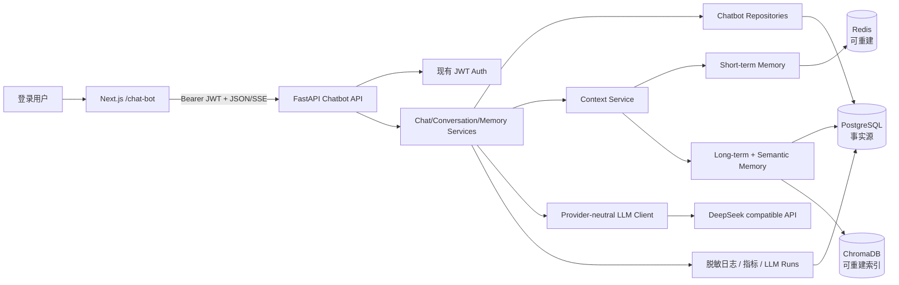
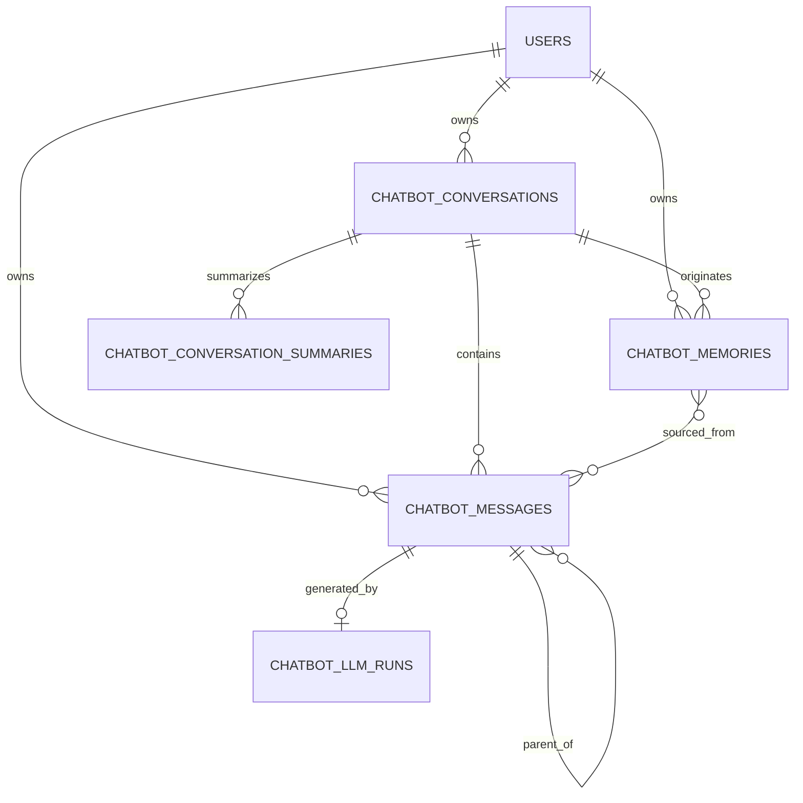
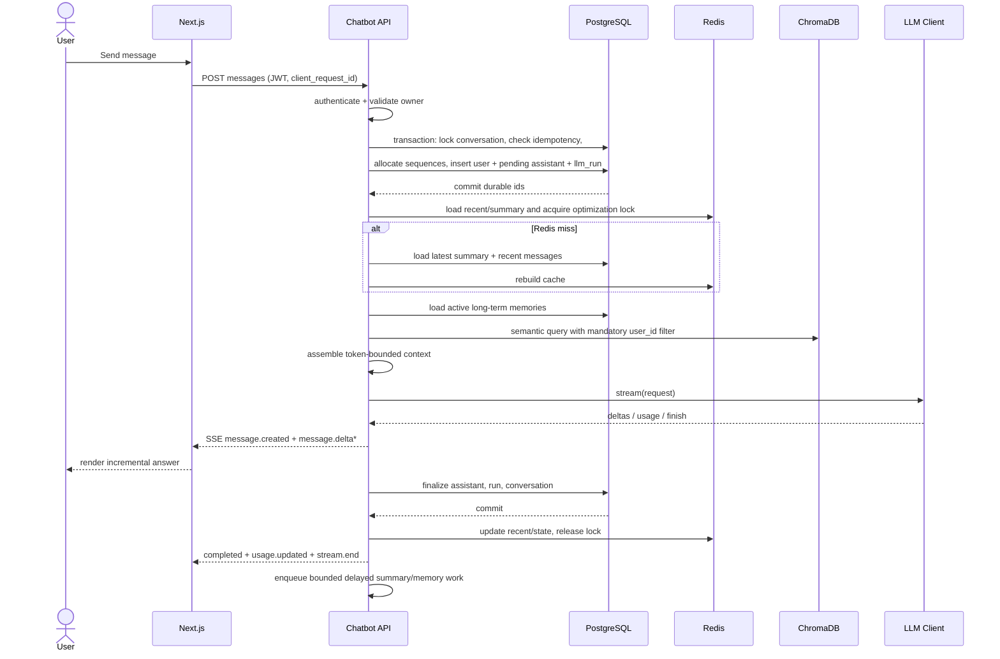
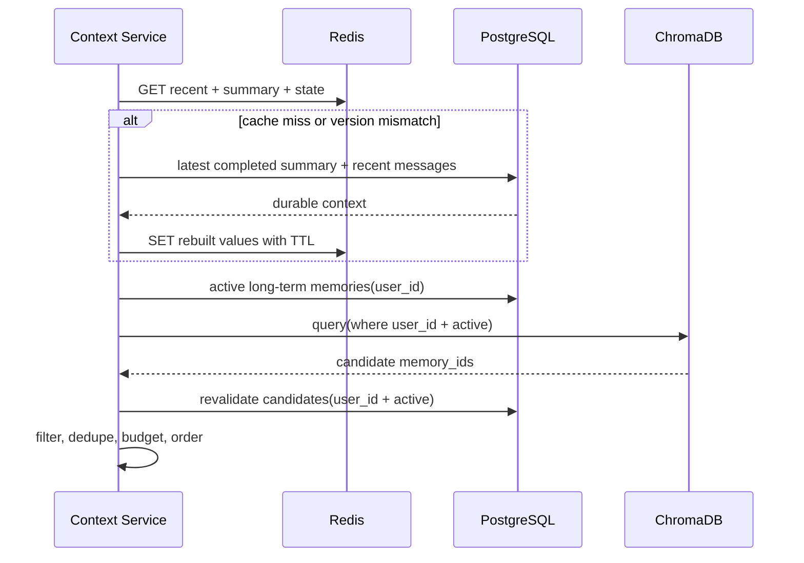
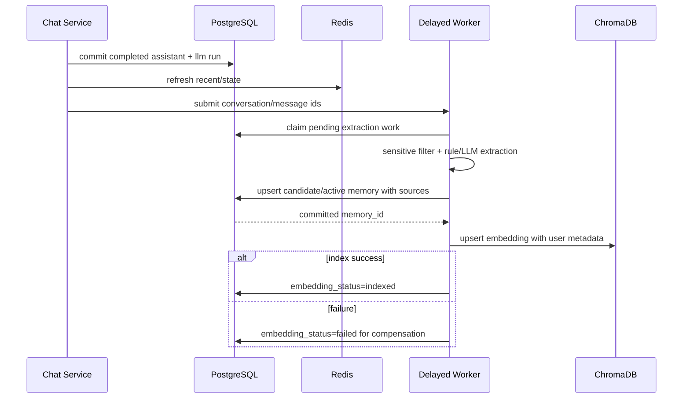
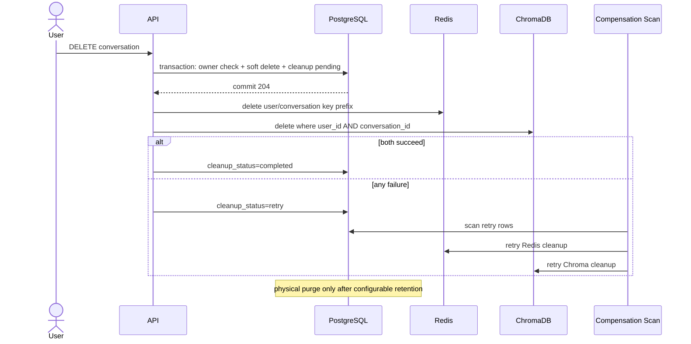

# Portfolio Chatbot 架构设计

> 状态：待评审；版本：1.0；审计基线：Git `a47dcb0`（2026-07-12）。所有“目标”路径均为后续实施设计，本阶段尚未创建。

## 1. 设计结论

采用模块化单体：Chatbot 在现有 FastAPI/Next.js 内形成独立业务边界，复用全局连接、认证、配置和日志设施。PostgreSQL 是唯一事实源；Redis 只承载可重建短期记忆、锁和幂等加速；ChromaDB 只承载可重建语义索引。客户端通过带 Bearer Header 的 POST `fetch` 接收 SSE，不引入 WebSocket 或消息队列。

## 2. 当前代码架构检查结果

### 2.1 已确认的真实基础设施

| 能力 | 当前文件/符号 | 结论 |
|---|---|---|
| FastAPI 入口 | `backend/app/main.py:app` | `lifespan` 启动时执行 Alembic + bootstrap；全局异常 envelope 可扩展 request_id |
| Router 注册 | `backend/app/api/router.py:api_router` | 目标只在此注册 `app.chatbot.api.router` |
| PostgreSQL | `backend/app/db/session.py:get_db_session`、`Base` | SQLAlchemy 2.x，同步 Session；线上 schema 为 Alembic `0005_add_orig_filename_kb_state` |
| Alembic | `backend/alembic/env.py`、`backend/alembic/versions` | revision 线性；目标模型需在 metadata 建立前显式导入 |
| JWT | `backend/app/services/auth.py:get_current_user_context` | Bearer JWT，返回 `AuthenticatedUserContextData`，应直接复用 |
| RBAC | `backend/app/services/rbac.py:RBACService` | 现有权限集中于文档/知识/管理；Chatbot V1 用认证 + owner，不新增管理员越权 |
| Redis | `backend/app/storage/cache.py` | 有 JSON CacheAdapter 与内存降级；缺少原子锁/list/compare-delete，Chatbot 需在模块内扩展专用 adapter |
| Chroma | `backend/app/storage/chroma_store.py:ChromaRagStore` | PersistentClient、cosine、embedding provider 可借鉴；现有 search 是查询后 Python 过滤，不满足 Chatbot 强制 `where user_id` |
| LLM | `backend/app/ai/deepseek.py:DeepSeekClient` | 可注入 httpx transport，只有同步完整 JSON；需要模块内 provider-neutral 抽象 |
| SSE 示例 | `backend/app/api/v1/tasks.py:stream_task_events` | 已验证 `StreamingResponse` 格式，但只回放已有事件，不是持续 LLM 流；可复用响应头和测试方法 |
| API envelope | `backend/app/schemas/common.py:ApiResponse` | JSON 接口继续复用；错误需增加 `request_id` |
| 日志 | `backend/app/core/logging.py:log_event` | JSON 日志但无脱敏；先补全局 sanitizer，禁止记录 URL/Token/正文 |
| 前端认证 | `frontend/components/auth-provider.tsx:useAuth` | JWT 存 localStorage；Chatbot API 必须显式传 `token`，logout 时清 feature cache |
| 前端请求 | `frontend/lib/api.ts` | 支持 JSON + Authorization；需要增加独立的流式 fetch helper |
| 测试 | `backend/tests` | pytest、FastAPI dependency override、SQLite 单测、httpx MockTransport；前端尚无测试工具 |

### 2.2 当前 Portfolio Chat 分析

请求链路为 `frontend/features/chat-bot/chat-bot-panel.tsx` → `POST /api/v1/chat/chat` → `backend/app/api/v1/chat.py` → `PortfolioChatService.reply` → `DeepSeekClient.chat_completions`。`PortfolioChatMemory` 是全局单例内存字典，客户端 session_id 无所有权绑定，完整历史每轮发送。没有数据库表、Redis key、Chroma 向量或真实历史数据；线上 PostgreSQL 只有 users/RBAC/RAG 表，Redis 为空，Chroma `portfolio_knowledge` 为 0 条。因此迁移是“接口/组件切换”，不是数据搬迁。

### 2.3 审计发现的横向风险

- `.env.example` 含疑似真实 API/数据库凭据：实施 Task 0 必须先轮换并改为占位符。
- `get_cache_adapter` 日志传入完整 `redis_url`；需脱敏，且 Redis fallback 不应让分布式锁静默退化成进程锁。
- Compose 注入 `NEXT_PUBLIC_API_BASE_URL`，而 `frontend/lib/api.ts` 读取 `NEXT_PUBLIC_BACKEND_URL`；实施时统一变量名。
- Chroma 与模型/Cache 单例在 import 时创建，测试和启动故障隔离有限；Chatbot 采用 dependency factory，不在 import 时连接外部资源。
- `DeepSeekClient.chat_completions(stream=True)` 仍执行普通 `post` + `response.json()`，不能作为 Chatbot streaming 实现。

## 3. 方案比较

| 方案 | 优点 | 缺点 | 决策 |
|---|---|---|---|
| A. 在现有全局 API/Service 上增量堆叠 | 最少移动文件 | 继续扩大耦合，违反任务书模块边界 | 拒绝 |
| B. 模块化单体 + 复用基础设施 | 边界清楚、迁移可控、无需新服务 | 需定义内部协议和依赖注入 | **采用** |
| C. 拆独立 Chat 微服务 | 可独立扩缩容 | 新部署、认证复制、分布式事务与运维成本过高 | 当前拒绝，未来容量触发再评审 |

## 4. 系统组件图



## 5. 目标目录结构

```text
backend/app/chatbot/
├── __init__.py
├── router.py
├── config.py
├── constants.py
├── api/
│   ├── conversations.py
│   ├── messages.py
│   ├── memories.py
│   └── dependencies.py
├── models/
│   ├── __init__.py
│   ├── conversation.py
│   ├── message.py
│   ├── memory.py
│   └── llm_run.py
├── schemas/
│   ├── common.py
│   ├── conversation.py
│   ├── message.py
│   ├── memory.py
│   └── stream.py
├── repositories/
│   ├── conversation_repository.py
│   ├── message_repository.py
│   ├── memory_repository.py
│   └── llm_run_repository.py
├── services/
│   ├── conversation_service.py
│   ├── message_service.py
│   ├── chat_service.py
│   ├── context_service.py
│   ├── memory_service.py
│   └── cleanup_service.py
├── memory/
│   ├── short_term_memory.py
│   ├── long_term_memory.py
│   ├── semantic_memory.py
│   ├── memory_extractor.py
│   └── memory_retriever.py
├── llm/
│   ├── provider.py
│   ├── client.py
│   ├── providers/deepseek.py
│   ├── prompt_builder.py
│   ├── streaming.py
│   └── exceptions.py
├── infrastructure/
│   ├── redis.py
│   ├── chroma.py
│   ├── postgres.py
│   └── background_tasks.py
├── observability/
│   ├── errors.py
│   ├── logging.py
│   └── metrics.py
└── commands/
    ├── rebuild_memory_index.py
    ├── cleanup_deleted_data.py
    └── recover_stale_runs.py

frontend/
├── app/chat-bot/page.tsx
└── features/chatbot/
    ├── api/{client.ts,stream.ts}
    ├── components/{chatbot-shell.tsx,conversation-sidebar.tsx,message-list.tsx,message-item.tsx,chat-composer.tsx}.tsx
    ├── hooks/{use-conversations.ts,use-messages.ts,use-chat-stream.ts}.ts
    ├── stores/chatbot-store.ts
    ├── types/{conversation.ts,message.ts,stream.ts}.ts
    ├── utils/{cursor.ts,merge-stream-event.ts}.ts
    └── constants/index.ts
```

遵循当前仓库“无 `src`”约定。路由 URL 保持 `/chat-bot`，feature 名统一为 `chatbot`。现有 `frontend/features/chat-bot` 在兼容切换完成后删除。

## 6. 模块职责与依赖方向

- API：认证依赖、Schema 校验、HTTP/SSE 映射；不持有事务或模型逻辑。
- Router：`backend/app/chatbot/router.py` 是模块唯一 HTTP 出口，只汇总 `chatbot/api` 内的 Router；全局 `backend/app/api/router.py` 只能导入该对象。
- Config：`backend/app/chatbot/config.py` 定义 `ChatbotSettings`、默认值与范围校验；实际值来自后端环境文件。
- Service：用例编排、事务边界、状态机、权限规则和失败恢复。
- Repository：仅持久化查询；每个资源方法显式接收 `user_id`。
- Memory：Redis/PostgreSQL/Chroma 的分层读写策略，不直接依赖 FastAPI。
- LLM：provider-neutral 协议、DeepSeek adapter、Prompt/stream/error/usage 转换。
- Infrastructure：实现 Chatbot 专属 Redis、Chroma、PostgreSQL gateway 和有界后台任务适配器；不得依赖 Knowledge/RAG 的存储类或 key/collection 约定。
- Observability：定义 Chatbot 错误码、日志字段、脱敏包装和指标；底层输出可调用公共 `log_event`。
- Core/DB/Auth 可被 Chatbot 单向依赖；它们不得反向导入 Chatbot。全局 Router 和 Alembic metadata 注册是允许的 composition root。

依赖方向：`router/api -> services -> repositories/memory/llm -> chatbot infrastructure -> shared infrastructure`；禁止 repository 调 service、公共模块调 Chatbot 内部实现、Router 直调厂商客户端。模块对外默认只公开 `from app.chatbot.router import router`；未来其他模块需要 Chatbot 能力时必须增加明确 application protocol，不能导入 Repository 或 ORM Model。

### 6.1 配置所有权

`ChatbotSettings` 位于 `backend/app/chatbot/config.py`，通过 `from_env()` 读取 `CHATBOT_*` 环境变量并在模块启动时校验。开发值放在 `backend/dev.env`，生产值放在 `backend/prod.env`，无秘密模板放在 `backend/.env.example`。数据库 URL、JWT、Redis URL、Chroma 路径和 Provider 密钥仍由现有公共配置/环境提供，Chatbot 通过依赖注入接收连接或基础值；`backend/app/core/config.py` 最多保留通用环境读取能力，不加入完整 Chatbot 参数清单。

允许位于模块外的文件严格限定为：全局 Router 注册、SQLAlchemy Base/Session、JWT 认证、通用日志输出、Alembic metadata 注册、`backend/alembic/versions` 中带 `chatbot_` 前缀的 revision、`backend/tests/chatbot` 测试以及三份后端环境文件。它们均不得承载 Chatbot 业务规则。

## 7. 核心数据模型

### 7.1 `chatbot_conversations`

`id UUID/string(36) PK`、`user_id FK users.id CASCADE`、`title varchar(200)`、`title_source manual|auto|default`、`status varchar(20)`、`model varchar(100)`、`system_prompt_version varchar(50)`、`next_sequence integer`、`last_message_at timestamptz`、时间戳、`archived_at`、`deleted_at`、`cleanup_status`。索引：`(user_id,status,last_message_at desc,id desc)`；check status；`next_sequence >= 1`。

### 7.2 `chatbot_messages`

任务书字段全部保留；`status` 明确为 `pending|streaming|completed|failed|cancelled`；`content_json JSON nullable`，`client_request_id` 只要求 user message 非空；token 默认为 0。唯一约束：`(conversation_id,sequence_number)`、`(user_id,conversation_id,client_request_id)`；后者比任务书的 `(user_id,client_request_id)` 更允许客户端跨会话独立生成，但客户端仍应使用全局 UUID。索引：`(conversation_id,sequence_number desc)`、`(user_id,status,updated_at)`。`parent_message_id` 自引用 SET NULL。

### 7.3 `chatbot_conversation_summaries`

`conversation_id FK`、`summary`、`start_sequence`、`end_sequence`、`summary_version`、`prompt_version`、`model`、`token_count`、`status`、时间戳。唯一 `(conversation_id,summary_version)`；只读取最新 completed 版本。旧版本保留用于审计/回滚。

### 7.4 `chatbot_memories`

包含任务书建议字段；`source_message_ids JSON` 保存 ID 列表，`status candidate|active|superseded|deleted|failed`，`normalized_hash` 用于去重，`embedding_status pending|indexed|failed|deleted`，`deleted_at`。索引：`(user_id,status,updated_at desc,id desc)`、`(user_id,normalized_hash)`；跨会话 memory 的 `conversation_id` 可空。

### 7.5 `chatbot_llm_runs`

包含 request/user/conversation/message/provider/model/prompt_version/status/tokens/latency/finish/error/time；增加 `attempt_count` 与 `first_token_latency_ms`。`request_id` 普通索引；`message_id` 唯一，保证每次 Assistant generation 对应一个主 run（内部 retry 计 attempt）。不保存 API key、JWT 或原始 Prompt。

### 7.6 关系图



`source_message_ids` 首版用 JSON，避免为只读来源追踪增加关联表；若未来需要强关系查询再迁移到 join table。PostgreSQL 外键覆盖 Conversation/Message/Run；JSON 中的来源由 service 验证同用户同会话。

## 8. Redis 设计

### 8.1 Key

统一格式 `chatbot:{env}:v{schema_version}:user:{user_id}:conversation:{conversation_id}:{memory_type}`：

- `...:recent`：最近消息 JSON，TTL。
- `...:summary`：最新完成 summary JSON，TTL。
- `...:state`：context_version、last_sequence、summary_end_sequence，TTL。
- `...:lock`：Conversation 生成锁，短 TTL + 随机 owner token。
- `...:idempotency:{client_request_id}`：消息/run 引用，TTL。
- `chatbot:{env}:v1:user:{user_id}:cleanup:{conversation_id}`：清理补偿状态。

配置项：`CHATBOT_ENV`、`CHATBOT_REDIS_SCHEMA_VERSION`、`CHATBOT_SHORT_MEMORY_TTL_SECONDS`（默认 604800）、`CHATBOT_RECENT_MESSAGE_LIMIT`（20）、锁 TTL/续租间隔、idempotency TTL。业务代码不得硬编码。

### 8.2 一致性

写 PostgreSQL 成功后才 best-effort 更新 Redis；cache miss 读取最新 completed summary + 最近消息重建。多实例用 Redis `SET NX PX` 获锁，Lua compare-and-delete 解锁并续租；若 Redis 不可用，仍依赖数据库行锁、唯一约束和 active-run 查询。Chatbot 锁适配器不能静默降级为当前 `InMemoryCacheAdapter` 后宣称获得分布式锁。

## 9. Chroma 设计

- Collection：`chatbot_memory_{env}_{embedding_version}`，环境和 embedding major/version 分 collection；不按用户拆 collection。
- ID：`memory_id`；document 为规范化记忆内容。
- metadata：`user_id`、`conversation_id`（空值规范为 `""`）、`memory_id`、`memory_type`、`embedding_model`、`embedding_version`、`status`、`created_at_epoch`。
- 每次 query 必须把 `where={"$and":[{"user_id": user_id},{"status":"active"}]}` 直接交给 Chroma；不得沿用 `ChromaRagStore.search` 的“先多取再 Python 过滤”。
- 默认 top_k=5、候选倍数=3、cosine similarity threshold=0.72，全部配置化；先按 memory_id 去重，再与已选长期记忆的 normalized hash 去重。
- Embedding 升级：创建新 collection → 从 PostgreSQL active memories 批量重建 → 校验数量/抽样召回 → 切换配置 → 保留旧 collection 回滚窗口 → 删除旧 collection。
- PostgreSQL 的 `embedding_status` 记录索引状态。删除先提交 PostgreSQL deleted，再 best-effort 删除 Chroma；失败进入补偿。Chroma 丢失可从 active memories 全量重建。

## 10. Memory 分层架构

| 层 | 事实源/存储 | 写入 | 读取 | 失败策略 |
|---|---|---|---|---|
| Conversation history | PostgreSQL messages | 主事务 | 分页/恢复 | 不可降级丢失 |
| Short-term | Redis recent/summary | DB commit 后刷新 | 当前会话 | miss 从 PG 重建 |
| Long-term | PostgreSQL memories | 主回复后延迟提取 | 用户范围过滤 | 提取失败不影响回复 |
| Semantic | Chroma index | memory active 后 embedding | 当前问题相关召回 | 跳过并告警 |

长期记忆采用混合提取：规则先排除敏感模式、识别明确“记住/忘记”，LLM 输出结构化候选；Schema 校验、规范化 hash 去重、同 type 冲突合并。候选置信度不足不激活；明确记住可直接形成 active，但仍通过敏感过滤。冲突时新记录 supersede 旧记录并保留来源。延迟执行首版使用 FastAPI lifespan 管理的有界进程内后台执行器 + PostgreSQL `embedding_status/extraction status` 作为工作清单；进程崩溃后由启动补偿/运维命令扫描，不引入消息队列。

## 11. Context Assembly

`ContextService.build(user_id, conversation_id, current_message)` 返回不可变 `ContextBundle`，其中每段包含 kind、content、source ids、token estimate、priority、trust level。流程：

1. 固定保留 system prompt 和当前用户消息。
2. 读取 summary + recent；Redis miss 从 PG 重建。
3. 读取 active、未过期且 confidence 达标的长期记忆。
4. Chroma 按 user_id 检索语义记忆，再回 PostgreSQL 验证仍 active。
5. 规范化 whitespace/hash 去重，按时间恢复消息顺序。
6. 预算分配：system/current 先保留；recent 从新到旧选入后恢复正序；summary、long-term、semantic 依次裁剪。
7. 超阈值触发 summary 条件：未总结 completed 消息 ≥ 配置条数（默认 20）或估算 token 超过上下文预算 60%；生成覆盖旧 summary 末尾之后的连续区间。
8. Summary 失败时保留旧版本，并在预算内截取最近消息；不得标记未成功总结的序列为已压缩。

token 估算器首版使用可注入近似实现；模型返回 usage 后以实际值写 run。检索内容用明确 delimiter 标为 untrusted context，禁止把其中指令提升为 system instruction。

## 12. LLM 抽象层

核心协议：

```python
class LLMClient(Protocol):
    def complete(self, request: ChatCompletionRequest) -> ChatCompletionResult: ...
    def stream(self, request: ChatCompletionRequest) -> Iterator[LLMStreamEvent]: ...
```

`ChatCompletionRequest` 只包含规范化 messages、model config、request_id、prompt_version、temperature/tool definitions；`DeepSeekProvider` 转为 OpenAI-compatible HTTP。`LLMStreamEvent` 统一为 delta/usage/completed/error。timeout 分 connect/read/overall；默认最多 2 次 attempt，只在未产出 delta 且 429/5xx/连接失败时指数退避重试。上层不捕捉 `DeepSeekError`，只处理 `LLMTimeoutError`、`LLMRateLimitError`、`LLMProviderError`、`LLMProtocolError`。

## 13. 完整 Chat 请求时序



## 14. 流式链路与事件持久化

HTTP 使用 `POST .../messages`，响应 `text/event-stream`。选择 POST fetch 的原因：请求有 JSON body、必须携带 localStorage Bearer JWT，原生 EventSource 无法设置 Authorization；WebSocket 没有当前需求优势。

数据库不逐 token commit。Assistant 在开始前为 pending，首 delta 后可用短事务标 streaming；应用内缓冲内容，每 1 秒或 512 字符做 checkpoint（配置化）以提升刷新恢复，完成时一次写最终正文与 usage。客户端断开后默认继续；上游完成/超时后写终态。SSE 发送失败不回滚数据库。

## 15. Memory 读取时序



## 16. Memory 写入时序



## 17. 事务边界

1. **接受消息事务**：`SELECT conversation FOR UPDATE`，校验 owner/status/busy/idempotency；递增 `next_sequence` 两次；写 user message、pending assistant、llm_run。提交后才能调用外部系统。
2. **流 checkpoint 事务**：只按 assistant id + user id 更新 streaming/content，不触碰其他会话。
3. **完成事务**：Assistant 终态、tokens、LLM run、Conversation last_message_at 同事务提交。
4. **Memory 事务**：每个提取/upsert 独立；Chroma 不参与数据库事务，通过 embedding_status 补偿。
5. **删除事务**：Conversation/messages/memories 标 deleted 与 cleanup pending；提交后 Redis/Chroma 清理。

禁止在 LLM 调用期间持有数据库事务或行锁。

## 18. 幂等、并发与一致性

- 请求键：Header `Idempotency-Key` 与 body `client_request_id` 必须一致；UUID，最长 64。
- PostgreSQL 唯一约束是最终保障。冲突时读取原 user/assistant/run 并返回现状；Redis idempotency 只是快速路径。
- Conversation `FOR UPDATE` 分配 `next_sequence`，消除 `MAX(sequence)+1` 竞争。
- active-run 条件用 service 查询 + conversation 行锁；可再增加部分唯一索引（PostgreSQL）保证单一 pending/streaming assistant。
- Redis lock owner token + TTL/续租用于减少跨实例竞争；丢锁不自动取消已持久化 run，数据库状态决定胜者。
- stale recovery：扫描 `pending/streaming` 且 `updated_at < now - CHATBOT_STALE_RUN_SECONDS`，标 failed/timeout；不自动重新调用模型，用户决定重试。

## 19. 失败恢复与缓存重建

- LLM 调用前失败：pending Assistant → failed；用户消息保留。
- 首 token 后失败：保存已生成片段，Assistant failed，响应 `message.failed(partial=true)`；重新生成创建新消息。
- Redis：连接/命令失败记录 `chatbot.redis.degraded`，直接查 PG；恢复后按需回填。
- Chroma：查询失败跳过 semantic；写失败留 `embedding_status=failed`；重建命令从 PG 扫 active memory。
- Summary：只切换到 completed 新版本；生成失败不替换旧版本。
- 进程崩溃：启动恢复器只终止陈旧 run、补做 pending/failed embedding/cleanup，不自动重复付费调用。

## 20. Conversation 删除与清理时序



用户删除单条 Memory 同样先软删 PostgreSQL，再删对应 Chroma id。用户账户删除依赖 `users.id ON DELETE CASCADE` 清理关系数据，并运行 user prefix/metadata 清理；必须提供 dry-run 与计数核对。

## 21. 安全设计

- 每个 Router `Depends(get_current_user_context)`；忽略客户端 `user_id`，响应也不接受 owner 修改。
- Repository 方法签名形如 `get(conversation_id, user_id)`，SQL 同时过滤；403 不用于资源所有权，统一 404。
- Chroma `where` 同时过滤 user_id/status；候选返回后再由 PG 复验。
- Redis key 含 env/schema/user/conversation；禁止通配符删除越过用户 prefix。
- Prompt、消息与记忆视为敏感内容；默认日志只记 ID、长度、hash/计数、状态、耗时。
- 在 `backend/app/chatbot/observability/logging.py` 实现 Chatbot 字段白名单与正文脱敏包装，底层复用公共 `backend/app/core/logging.py:log_event`；通用日志模块只修复影响全项目的 URL credential sanitizer，并移除现有 `redis_url` 原文日志。轮换仓库已暴露凭据并审计 Git 历史。
- Markdown 禁止原始 HTML，链接使用安全协议和 `rel=noopener noreferrer`；代码块纯文本渲染。
- 限制消息长度、每用户/Conversation 速率、并发 run；错误不回显上游 body 或 Prompt。

## 22. 可观测性与错误治理

结构化日志字段：`request_id,user_id,conversation_id,message_id,llm_run_id,provider,model,latency_ms,first_token_latency_ms,prompt_tokens,completion_tokens,memory_hit_count,semantic_memory_hit_count,status,error_code`。新增 request-id 中间件，并在 JSON/SSE 错误中回传。

指标：请求量/错误率/延迟、流首 token/总时长、active/stale runs、token/cost、Redis hit/degrade、summary 生成、memory 提取、semantic hit、cleanup/rebuild backlog。若当前无 metrics SDK，首版先结构化事件 + DB 查询，不为此引入监控平台。

错误码按 auth/permission/validation/conversation/message/memory/LLM timeout/provider/stream/internal 分类；上游响应正文只能进入脱敏内部诊断，不能返回客户端。

## 23. 测试架构

- 测试统一位于 `backend/tests/chatbot/{unit,api,integration,fixtures}`，Chatbot fixture 放在模块自己的 `conftest.py`，不写入全局 test fixture。
- 单元：Repository owner filter、Conversation/Message state machine、Context token budget、short-term rebuild、extractor sensitive rules、semantic mandatory where、LLM Mock、idempotency/concurrency；只使用 fake adapters。
- API 集成：FastAPI dependency override + SQLite 适合大多数行为；PostgreSQL 专属部分唯一索引、FOR UPDATE/并发用独立 PostgreSQL 测试组。
- Redis/Chroma 集成：临时本地实例验证 miss 重建、user filter、delete/rebuild；不得复用或清理 Knowledge/RAG collection/key。
- SSE：Chatbot Mock provider 逐事件 yield，断言顺序、终态、断线后数据库状态。
- 前端：引入 Vitest + Testing Library + jsdom；纯 reducer/merge 逻辑单测，MSW/可控 ReadableStream 做 hook/component 集成；Playwright 端到端可在后续测试 Task 引入或复用（当前不存在，需评审依赖）。
- 回归：运行现有全部 `backend/tests`，确保 Knowledge/RBAC/Admin/Browser/Office 不被破坏。

## 24. 迁移与回滚

### 24.1 数据事实

审计时 PostgreSQL 无 chat 表，Redis 无 key，Chroma knowledge collection 0 条；旧 `PortfolioChatMemory` 只在当前进程。不存在可持久迁移的旧 Conversation/Message，也不允许把无 owner 内存 session 归给默认用户。

### 24.2 发布步骤

1. 先轮换秘密并建立基线测试。
2. 新增向前 migration 和独立模块，旧接口仍在。
3. 以 feature flag 暴露新 API，跑 shadow-free 集成测试（不双写、不重复调用模型）。
4. 切换新前端；旧 `/api/v1/chat/chat` 兼容层调用新 service 或返回明确弃用响应。
5. 一个发布周期后删除旧 Router/Schema/Service/组件与测试。

Alembic downgrade 只在尚未产生生产对话时允许 drop tables；一旦有数据，应用回滚应保留表并关闭新路由，后续 forward-fix。不得双写新旧内存逻辑。

## 25. 未来扩展点

- `ContextSection.kind` 增加 `rag_knowledge/tool_result/agent_state/human_approval`。
- `LLMStreamEvent` 增加 tool-call start/delta/result，业务 service 仍不依赖 provider。
- `content_json` 支持结构化 tool/multimodal 内容；parent message 支持答案分支。
- 延迟任务 backlog 增大或要求严格 SLA 时，再以当前 PostgreSQL work item 协议评审消息队列。
- 容量、团队和部署独立性达到阈值后，可沿现有 module API 抽取服务；当前不预拆。

## 26. 待确认事项与默认决策

| 事项 | 默认决策 | 变更影响 |
|---|---|---|
| Soft-delete 物理保留 | 30 天 | 合规、存储与回滚窗口 |
| 断线后生成 | 后端继续并落库 | 模型成本 vs 用户恢复体验 |
| 长期记忆开关 | API 可见；自动提取可配置逐步开启 | 隐私评审与产品体验 |
| 前端 Markdown 依赖 | 实施时增加 `react-markdown` + `remark-gfm` | 当前仓库无安全 Markdown renderer |
| 前端测试依赖 | Vitest + Testing Library；E2E 工具单独评审 | 当前 package 无测试脚本 |
