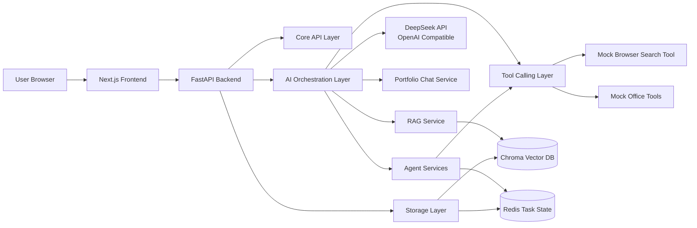

# Architecture

## 1. System Overview



## 2. Layer Responsibilities

| Layer | Responsibility |
| --- | --- |
| Frontend | Pages, navigation, chat UI, upload UI, workflow visualization, API client |
| Backend API | FastAPI routes, request validation, response envelope, CORS, error handling |
| Services | Business orchestration for chat, RAG, agents, tasks, and architecture graph data |
| AI Layer | DeepSeek client, prompts, RAG pipeline, LangGraph workflows in V3 |
| Tools | Mock browser search, mock office tools, retrieval tools |
| Storage | Chroma vector database in V2, Redis task state/events in V3 |

## 3. Directory Structure

```text
paiguangguang/
  frontend/
    app/
      page.tsx
      agents/
      architecture/
    components/
    features/
      portfolio-chat/
      knowledge-agent/
      browser-agent/
      office-agent/
      architecture-flow/
    lib/
    styles/
    types/
    public/

  backend/
    app/
      main.py
      core/
      api/
      schemas/
      services/
      ai/
      storage/
      tools/
      workers/
      utils/
    tests/

  docs/
    PROJECT_SPEC.md
    architecture.md
    roadmap.md
    codex_tasks.md

  docker/
  .env.example
  README.md
```

## 4. Folder Responsibilities

| Folder | Responsibility |
| --- | --- |
| `frontend/app` | Next.js routes and page entry files |
| `frontend/components` | Reusable UI components only |
| `frontend/features` | Module-specific UI and client-side behavior |
| `frontend/lib` | API client, config, shared helpers |
| `frontend/types` | Shared frontend TypeScript types |
| `backend/app/core` | Settings, logging, CORS, errors, response envelope |
| `backend/app/api` | FastAPI routers grouped by module |
| `backend/app/schemas` | Pydantic request and response models |
| `backend/app/services` | Business logic and orchestration |
| `backend/app/ai` | LLM client, prompts, RAG pipeline, LangGraph workflows |
| `backend/app/storage` | Chroma and Redis adapters |
| `backend/app/tools` | Agent-callable mock tools |
| `backend/app/workers` | Long-running task runners used in V3 |

## 5. API Conventions

All JSON APIs use `/api/v1` prefix.

Standard JSON response envelope:

```json
{
  "success": true,
  "data": {},
  "error": null
}
```

Error response envelope:

```json
{
  "success": false,
  "data": null,
  "error": {
    "code": "ERROR_CODE",
    "message": "Human readable error"
  }
}
```

SSE endpoints may stream event payloads and do not need the JSON envelope per event.

## 6. FastAPI Route Design

| Method | Path | Phase | Purpose |
| --- | --- | --- | --- |
| `GET` | `/api/v1/health` | V1 | Health check |
| `GET` | `/api/v1/modules` | V1 | List enabled portfolio modules |
| `GET` | `/api/v1/projects` | V1 | Return static project/profile data |
| `POST` | `/api/v1/chat/portfolio` | V1 | Portfolio Chat request |
| `GET` | `/api/v1/chat/sessions/{session_id}` | V1 | Read chat history |
| `POST` | `/api/v1/rag/documents` | V2 | Upload or register a document |
| `POST` | `/api/v1/rag/ingest` | V2 | Chunk, embed, and store document text |
| `POST` | `/api/v1/rag/query` | V2 | Retrieve context and answer with citations |
| `GET` | `/api/v1/rag/collections` | V2 | List Chroma collections |
| `GET` | `/api/v1/architecture/graphs/system` | V2 | Return React Flow nodes and edges |
| `POST` | `/api/v1/agents/browser/run` | V3 | Run mock Browser Agent workflow |
| `POST` | `/api/v1/agents/office/run` | V3 | Run mock Office Agent workflow |
| `GET` | `/api/v1/tasks/{task_id}` | V3 | Read long-running task state |
| `GET` | `/api/v1/tasks/{task_id}/events` | V3 | Stream task events with SSE |

## 7. Request and Response Contracts

Portfolio Chat request:

```json
{
  "message": "string",
  "session_id": "string | null"
}
```

Portfolio Chat data:

```json
{
  "reply": "string",
  "session_id": "string"
}
```

RAG query request:

```json
{
  "question": "string",
  "collection": "string",
  "top_k": 5
}
```

RAG query data:

```json
{
  "answer": "string",
  "sources": [
    {
      "doc_id": "string",
      "chunk_id": "string",
      "text": "string",
      "score": 0.0
    }
  ]
}
```

Agent run data:

```json
{
  "task_id": "string",
  "steps": [
    {
      "action": "string",
      "input": {},
      "result": {}
    }
  ],
  "final": {}
}
```

## 8. Implementation Constraints

- V1 must not require Chroma, Redis, LangGraph, file uploads, or real tools.
- V2 adds Chroma and RAG only.
- V3 adds LangGraph-style orchestration, Redis-backed task state, SSE events, and mock tools.
- Frontend must call backend through `frontend/lib` API helpers, not direct scattered fetch calls.
- Backend route handlers should stay thin and delegate logic to services.

## 9. Risk Controls

- DeepSeek API may differ from OpenAI in streaming, error shape, and model parameters, so all calls must go through one backend client wrapper.
- RAG quality depends on chunking, metadata, and source tracing, so V2 tasks must keep deterministic chunk IDs and citation metadata.
- Chroma persistence paths and embedding behavior must be testable locally, with fake embeddings used in unit tests where possible.
- Redis and SSE should not be introduced before V3, because early task state complexity can slow down the MVP.
- Frontend and backend response shapes must stay aligned through `frontend/types` and `backend/app/schemas`.
- Agent demos must show steps and tool outputs, not only final answers, otherwise the portfolio loses its engineering proof.
