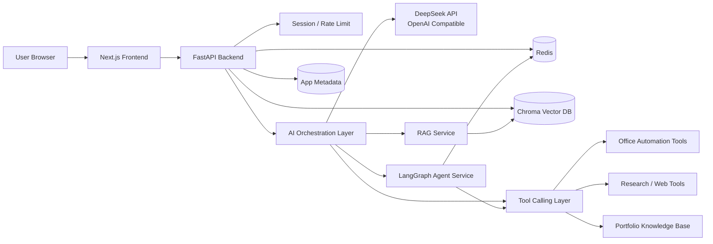

**1. 总体架构**

````

````

推荐分层：

- `Frontend`：展示作品集、架构图、聊天界面、任务运行状态。
- `Backend API`：统一鉴权、请求校验、任务调度、流式响应。
- `AI Layer`：封装 DeepSeek、RAG、LangGraph、多 Agent、工具调用。
- `Storage`：Chroma 存向量知识库，Redis 存会话、任务状态、Agent 中间状态。

**2. 目录结构**

```
paiguangguang/
  frontend/
    app/
    components/
    features/
    lib/
    types/
    styles/
    public/

  backend/
    app/
      main.py
      core/
      api/
      schemas/
      services/
      ai/
      storage/
      workers/
      tools/
      utils/
    tests/

  docs/
    architecture.md
    api.md
    roadmap.md

  docker/
  .env.example
  README.md
```

**3. 模块拆分**

`frontend/app`：Next.js App Router 页面入口，例如首页、架构可视化页、RAG Demo、Agent Demo、Portfolio Chat。

`frontend/components`：通用 UI 组件，例如按钮、布局、消息气泡、加载状态、错误状态。

`frontend/features`：按业务模块组织页面逻辑，例如 `portfolio-chat`、`rag-agent`、`architecture-flow`、`research-agent`。

`frontend/lib`：API client、SSE/WebSocket 封装、前端配置、工具函数。

`frontend/types`：前后端共享的 TypeScript 类型。

`backend/app/core`：配置、日志、异常处理、CORS、限流、环境变量。

`backend/app/api`：FastAPI 路由层，只做请求接收、参数校验和响应返回。

`backend/app/schemas`：Pydantic 请求/响应模型。

`backend/app/services`：业务服务层，例如项目管理、聊天会话、任务状态管理。

`backend/app/ai`：AI 核心层，包括 DeepSeek client、RAG pipeline、LangGraph workflows、prompt 管理。

`backend/app/storage`：Chroma、Redis、未来数据库的连接与 repository 封装。

`backend/app/tools`：Agent 可调用工具，例如文档检索、Office 自动化、研究搜索、项目资料查询。

`backend/app/workers`：长任务执行，例如文档入库、研究任务、多 Agent 流程。

**4. API 设计**

基础接口：

| Method | Path               | 用途               |
| ------ | ------------------ | ------------------ |
| `GET`  | `/api/v1/health`   | 健康检查           |
| `GET`  | `/api/v1/modules`  | 获取作品集模块列表 |
| `GET`  | `/api/v1/projects` | 获取项目数据       |

架构可视化：

| Method | Path                               | 用途                     |
| ------ | ---------------------------------- | ------------------------ |
| `GET`  | `/api/v1/architecture/graphs`      | 获取架构图列表           |
| `GET`  | `/api/v1/architecture/graphs/{id}` | 获取 React Flow 节点和边 |

Portfolio Chat：

| Method | Path                            | 用途         |
| ------ | ------------------------------- | ------------ |
| `POST` | `/api/v1/chat/portfolio`        | 普通问答     |
| `POST` | `/api/v1/chat/portfolio/stream` | 流式问答     |
| `GET`  | `/api/v1/chat/sessions/{id}`    | 获取会话历史 |

Enterprise RAG：

| Method | Path                      | 用途                   |
| ------ | ------------------------- | ---------------------- |
| `POST` | `/api/v1/rag/documents`   | 上传/登记文档          |
| `POST` | `/api/v1/rag/ingest`      | 文档切分、向量化、入库 |
| `POST` | `/api/v1/rag/query`       | RAG 检索问答           |
| `GET`  | `/api/v1/rag/collections` | 查看知识库集合         |

Agent 系统：

| Method | Path                             | 用途                   |
| ------ | -------------------------------- | ---------------------- |
| `POST` | `/api/v1/office/tasks`           | 创建 Office 自动化任务 |
| `POST` | `/api/v1/research/runs`          | 创建多 Agent 研究任务  |
| `GET`  | `/api/v1/tasks/{task_id}`        | 查询任务状态           |
| `GET`  | `/api/v1/tasks/{task_id}/events` | SSE 返回任务过程事件   |

**5. 开发顺序**

```
V1：作品集可展示 + 基础 AI 问答
```

- 搭建 Next.js + FastAPI 基础工程。
- 完成首页、模块导航、项目展示页。
- 完成 Portfolio Chat Agent，先用静态项目资料 + DeepSeek。
- 完成基础 API client、错误处理、loading 状态。
- 目标：网站能展示能力，并能围绕你的项目进行聊天。

```
V2：RAG + 架构可视化
```

- 引入 Chroma，完成文档入库、切分、检索、引用来源返回。
- 完成 Enterprise RAG Agent 页面。
- 完成 React Flow 架构图页面，展示 RAG、Agent、Tool Calling 架构。
- 加入 Redis 存会话上下文和任务状态。
- 目标：体现真正 AI 工程能力，而不是单纯聊天壳。

```
V3：LangGraph + 多 Agent + Office 自动化
```

- 引入 LangGraph 编排 Agent 流程。
- 完成 Office Automation Agent，例如生成文档摘要、表格分析、PPT 大纲。
- 完成 Multi-Agent Research System，包括规划、搜索、总结、报告生成。
- 增加任务进度流式展示、失败重试、工具调用日志。
- 目标：形成完整 AI Engineer Portfolio Demo。

**6. 风险点**

- `DeepSeek API` 兼容 OpenAI，但流式响应、错误格式、模型参数可能有差异，需要单独封装 client。
- `RAG` 最容易踩坑的是文档切分质量、引用来源丢失、检索结果不稳定，V2 要优先做可观察日志。
- `LangGraph` 不要一开始做复杂多 Agent，先做单 Agent 状态图，再扩展多节点流程。
- `Redis` 不建议只当缓存用，Agent 任务状态、SSE 事件、会话上下文都要提前设计 key 结构。
- `Office Automation` 涉及文件解析和生成，容易受格式影响，V3 再做更稳。
- `前后端类型` 容易不一致，建议 API response schema 稳定后，在前端维护对应 `types`。
- `展示型项目` 容易变成纯 UI，建议每个模块都保留“输入、过程、输出、日志/引用”的工程闭环。